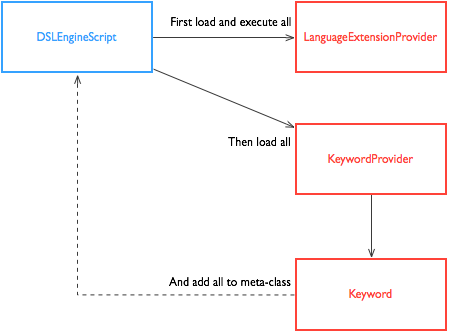

## Introduction  

I'm going to assume that you're already familiar with DSLs and Groovy if you're interested in this project. The intention behind creating diesel engine was quite simple, to quickly build DSLs. Also important was to keep this easy and reusable, so very simple patterns were used in building the initial engine.  

## Developer Guide  

In diesel engine you'll find a single core class that does all the work, it bootstraps your DSL by finding and loading your DSL's keywords and language extensions at runtime. This is done by using a nice feature provided by Java called the **Service Provider Interface (SPI) API**. I won't spend much time detailing the SPI for you, if you wish to read more about it see [this Java tutorial](http://docs.oracle.com/javase/tutorial/sound/SPI-intro.html). The core class is `DSLEngineScript`, it extends Groovy's Script class and adds your keywords to its meta-class and loads any extensions. The other classes used by the engine are the `KeywordProvider` interface and the `Keyword` class. You'll use these two classes to implement the actual keywords to be used in your DSL. And if you want to extend the Groovy language you would implement the `LanguageExtensionProvider` interface. This interface has a single method `extend(script)` that you will implement when you want to extend the core language, like meta-programming `java.lang.String` or `java.lang.Number`. I'll list out what steps are required to create a simple DSL that you can test with. If you prefer, you can look at all the test cases and code in the `src/test/groovy` directory. In that directory you'll find test cases that execute against the DSL built in this documentation.  

**Where Everything Lives**  

* Core DSL: `DSLEngineScript` - `me.dslengine`  
* Language extension support: `LanguageExtensionProvider` - `me.dslengine.extension`  
* Keyword support: `Keyword` and `KeywordProvider` - `me.dslengine.keyword`  
* Preprocessing base support: `Change`, `ChangeChain`, `FileProcessor`, and `LineProcessor` - `me.dslengine.preprocessor`  
* Line change implementations: `AddQuotes`, `AddString`, and `SimpleStringReplace` - `me.dslengine.preprocessor.support`  

**Simple Class Diagram**  

  

### Using diesel engine  

**Build from repository**  

To work through the example below or to use diesel engine you'll need the **dslengine-x.x.x.jar** file. You can clone this repository and build the required jar file with Gant. Everything you need is in the project itself. There are no external dependencies other than Groovy and Gant. To build the jar run the following:  

    $ gant jar  

You'll end up with the jar in the `dist` directory.  

**Download jar from latest release.**  

You can also download the latest release jar from the [releases](https://github.com/eyeszack/diesel-engine/releases) page if you don't want to clone and build. Just package the jar as your project requires and include it in your classpath at runtime.  

**Installing with zip from latest release.**  

If you want to install diesel engine and use it to run your DSL scripts locally, download the latest release zip from the [releases](https://github.com/eyeszack/diesel-engine/releases) page. Unzip to a directory of your choice and set an environment variable that points to your installation.  

### Example Debugging DSL  

In this example we'll create a DSL that supports two keywords, `debug` and `echo`. The only function these keywords perform, is to print any string or number passed to it.  

**1)** First we'll implement the `KeywordProvider` interface so that we can define our debugging keywords. In this example we use the `Keyword` class directly versus extending it and creating our own class. You can choose how you prefer to do this.  

**DebuggingKeywordProvider.groovy**  
    
    package your.package  
    
    import me.dslengine.keyword.*  

    class DebuggingKeywordProvider implements KeywordProvider {  
        def keywords = []  
    
        def description = "Debugging Keywords - for testing Diesel Engine!!"  
       
        void addKeyword(keyword) {  
            keywords << keyword  
        }  
    
        void addKeyword(name, help, closure, aliases) {  
            def newKeyword = Keyword(name:name, help:help, closure:closure, aliases:aliases)  
            keywords << newKeyword  
        }  
    
        List<Keyword> getKeywords() {  
            def debugKeyword = new Keyword()  
            debugKeyword.name = "debug"  
            debugKeyword.help = "simple echo keyword"  
            debugKeyword.aliases = ["echo"]  
            debugKeyword.closure = { value ->  
                if (value instanceof List) {  
                    value.each {  
                        println "DEBUG: ${it}"  
                    }  
                } else if (value instanceof Map) {  
                    value.each { k,v ->  
                        println "DEBUG: ${k}:${v}"  
                    }  
                } else {  
                    println "DEBUG: ${value}"  
                }  
            }  
            keywords << debugKeyword  
    
            keywords  
        }  
    }  
 
**2)** Now compile your keyword provider class. You'll need to include the **dslengine-x.x.x.jar** in your compile classpath.  

**3)** Next, to actually have your keyword provider loaded and used at runtime you'll need to create a file named `me.dslengine.keyword.KeywordProvider`. In this file add a line with the fully qualified class name of your provider. If you have multiple classes you must include them each on their own line. If you copied the class in step one, your file would contain the following:  

**me.dslengine.keyword.KeywordProvider**  

    your.package.DebuggingKeywordProvider  

**4)** It's time to package your keyword provider in a jar and get it ready for use. Place all your classes in the jar file and place your `me.dslengine.keyword.KeywordProvider` file a directory named `services` under the `META-INF` directory of your jar. This is how java service providers are found at runtime. Your jar should contain the following files and directories:  

**jar file**  

    your/  
        package/  
            DebuggingKeywordProvider.class  
    META-INF/  
        services/  
            me.dslengine.keyword.KeywordProvider  
      
**5)** This final step can be implemented in quite a few ways. You need to create a way to actually run your DSL scripts with the `DSLEngineScript` class. I think the easiest way is to use a groovy script and run it like a shell script. In the example script below the `DSLEngineScript` class is set as the script base for the groovy shell. This means that groovy scripts run in that shell will have access to your keywords. But just as important is the section of code at the beginning, it will load any jar file it finds into the runtime classpath. You will need to create an environment variable named `DSLENGINE_HOME` that points to where you wish to keep your DSL code and the **dslengine-x.x.x.jar**. In that location add a `lib` directory and place **dslengine-x.x.x.jar** and your provider jar in there.  

**dslengine**  

    #!/usr/bin/env groovy  
    import groovy.io.FileType  

    new File("${System.getenv()["DSLENGINE_HOME"]}/lib").eachFile(FileType.FILES) {  
        this.class.classLoader.rootLoader.addURL(it.toURL())  
    }  

    import org.codehaus.groovy.control.*  

    if (args) {  
      def configuration = new CompilerConfiguration()  
      configuration.setScriptBaseClass("me.dslengine.DSLEngineScript")  
      def shell = new GroovyShell(configuration)  
      shell.evaluate(new File(args[0]))  
    } else {  
      println "usage: ./dslengine <input file>"  
    }  

**test.dsl**  

    debug "Hello everyone!"  
    echo "This is cool stuff!"  
    
To run, type the following in your terminal:  

    $ chmod 744 dslengine  
    $ ./dslengine test.dsl  

### Example Language Extension  

You'll more than likely spend most of your time developing keywords for your DSL. But you may want to extend some of Groovy's core classes or the actual script at runtime. To do this you implement the `LanguageExtensionProvider` interface. In this example we'll extend `java.lang.Number` to do something silly. The beauty of this is that inheritance is supported, so `java.math.BigDecimal` will also be extended.  

**1)** First implement the `LanguageExtensionProvider` interface by providing an implementation for the `extend(script)` method. In this example we'll add the ability to call `key String` on any number. So in your DSL if you had `89.key "Eighty Nine"` you'd see the following output `Eighty Nine:89` when it ran. You could also work with the `script` instance that's passed in.  

**NumberExtensionProvider.groovy**  

    package your.package  
    
    import me.dslengine.extension.*  

    class NumberExtensionProvider implements LanguageExtensionProvider {  
        void extend(script) {  
            Number.metaClass.key = { String key ->  
                println "${key}:${delegate}"  
            }  
        }  
    }  

**2)** The remaining steps are the same as implementing keywords, with the exception of the service provider file. For extensions you create a file named `me.dslengine.extension.LanguageExtensionProvider` with the fully qualified class name of your extension provider. It too should be placed in the `services` directory in `META-INF` of your jar. Keywords and extensions can live together in the same jar or separate jars, they will all be found at runtime.  

**me.dslengine.extension.LanguageExtensionProvider**  

    your.package.NumberExtensionProvider  

**test.dsl**  

    debug "Hello everyone!"  
    echo "This is cool stuff!"  
    89.key "Eighty Nine"  
    def test = new BigDecimal(99)  
    test.key "wow"  

### Bonus Java Example  

It's quite simple to write your DSL with the Groovy language, but what about using it in a Java application? Since everything written in Groovy is compiled to Java bytecode it's quite simple. All you need when you compile and run your Java application is a few jars. The example java class below is enough to run your DSL. Once compiled it can be used in a Java application or run in a terminal window. This is just a bare bones implementation, you may want to use this as a point of reference.  

**Compile time classpath dependencies**  

* The latest dslengine-x.x.x.jar  
* The groovy-x.x.x.jar, I use the one located in my groovy-2.3.9 `lib` directory  

**Runtime classpath dependencies, same as compile time plus:**  

* Your keyword and language extension jar(s)  

**DieselEngineScriptRunner.java**  

    import groovy.lang.GroovyShell;  
    import org.codehaus.groovy.control.CompilerConfiguration;  
    import java.io.File;  
    import java.io.IOException;  

    public class DieselEngineScriptRunner {  
    
        private GroovyShell shell;  
    
        public DieselEngineScriptRunner() {  
            CompilerConfiguration configuration = new CompilerConfiguration();  
            configuration.setScriptBaseClass("me.dslengine.DSLEngineScript");  
            shell = new GroovyShell(configuration);  
        }  
    
        public Object evaluateScript(File script) throws IOException {  
            return shell.evaluate(script);  
        }  
    
        public Object evaluateScript(String script) {  
            return shell.evaluate(script);  
        }  
    
        public static void main(String[] args) {  
            try {  
                DieselEngineScriptRunner runner = new DieselEngineScriptRunner();  
                runner.evaluateScript(new File(args[0]));  
            } catch (Exception e) {  
                System.out.println(e);  
            }  
        }  
    }  
    
To compile your java class you'll more than likely run something similar to:  

    $ javac -cp dslengine-1.1.0.jar:groovy-2.3.9.jar DieselEngineScriptRunner.java  
    
To test it you may run the following:  

    $ java -cp dslengine-1.1.0.jar:groovy-2.3.9.jar:your-keywords-extensions.jar:. DieselEngineScriptRunner <script>  

### Preprocessors  

As you begin developing your DSL you may find that you want to _"break"_ the Groovy syntax. This can make your DSL more approachable to your target audience, by reducing the amount of special characters or syntax fluff required. Something as simple as removing the need to include `()` is a nice touch, for example `save` versus `save()`. Or maybe you want to offer simplified keyword alternatives using operators like `>` or `&`. Any of these would introduce errors in the Groovy script and prevent it from being evaluated. Well don't let syntax get in the way of your dream DSL.  

In order to help enable this kind of DSL building, you can use the preprocessor classes included in the **dslengine-x.x.x.jar**. These classes are located in the `me.dslengine.preprocessor` and `me.dslengine.preprocessor.support` packages. These classes can help you implement a richer syntax for your DSL and can easily be extended for your needs. The classes provided are quite simple but should help address a good amount of scenarios. If you don't find what you need it should be easy to build your own preprocessors. And of course any contributions back to this project are welcome. :)   

#### Processing Changes to Scripts  
The approach taken for preprocessing is simple, each line of your script is read and changes are applied to the current line. This can be repeated until the entire file is processed, or conditionally on a line to line basis.  

**Making Changes**  
The obvious intent of preprocessing is to change your input scripts in some form.  Changes can be made by simply iterating over the script file and modifying as you iterate. To help with this you can implement the `Change` interface with the changes you wish to apply to the current line. If you need to apply multiple changes to a single line, you can use the `ChangeChain` class. As its name implies you will give `ChangeChain` multiple changes that it will iterate over and apply to the current line. To write a change all that you need to provide is the implementation for the `String applyTo(String line)` method of the `Change` interface.  

The following change classes are provided and can be used as a base to build your own:  

* `AddQuotes` - This change will allow you to wrap elements of the line with quotes. You can specify if you want the entire line wrapped, every element of the line wrapped, or you can specify a zero-based `int` array of the elements to wrap. By default this class will use a space as the delimiter for changes that require splitting the line. You can specify your own delimiter if needed.  
* `AddString` - This change will allow you to specify a string value to append, prepend or both to the line.
* `SimpleStringReplace` - This change replaces a string in the line with another string value. The string value to replace can also be a valid regex pattern.  

**Processing Files and Lines**  
As mentioned in the **Making Changes** section; changes are applied to the lines of a file. This is easy enough to do and most of the work is going to be in the changes and their logic. Even though it may be easy, two classes are provided for script preprocessing. The two main classes are the `FileProcessor` and `LineProcessor`. The `FileProcessor` will read a file and for each line in the file it will apply the change it was given. When completed a new `String` will be returned that represents the new script. This string can be used for evaluation by a Groovy shell or saved to a file and evaluated later. The original input file will not be changed by the `FileProcessor`.  The `LineProcessor` is given a single line and a change to apply, the intent in using a line processor is for more control over file preprocessing. You could create multiple changes and apply one or more to single line based on its contents. In this scenario you would control iterating over the file line by line.  

So that's preprocessing in a nutshell. If you would like to see some examples of changes being used and file processing; have a look at the tests in the repository.  

## License  

It's all good! :)  

Copyright (c) 2015 Isaac A. Gomez See the **LICENSE** file for license rights and limitations (MIT).  
