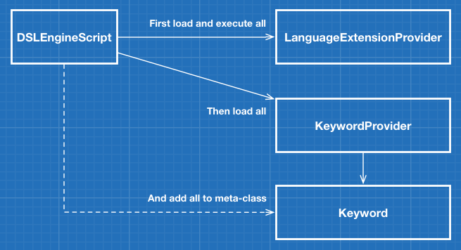

## Introduction

I'm going to assume that you're already familiar with DSLs and Groovy if you're interested in this project. The intention behind creating diesel engine was quite simple, to quickly build DSLs. Also important was to keep this easy and reusable, so very simple patterns were used in building the initial engine.

## Developer Guide

In diesel engine you'll find a single core class that does all the work, it bootstraps your DSL by finding and loading your DSL's keywords and language extensions at runtime. This is done by using a nice feature provided by Java
called the **Service Provider Interface (SPI) API**. I won't spend much time detailing the SPI for you, if you wish to read more about it see [this Java turtorial](http://docs.oracle.com/javase/tutorial/sound/SPI-intro.html).
The core class is the **DSLEngineScript** class, it extends Groovy's Script class and adds your keywords to its meta-class and loads any extensions. The other classes used by the engine are 
the **KeywordProvider** interface and the **Keyword** class. You'll use these two classes to implement the actual keywords to be used in your DSL. 
And if you want to extend the Groovy language you would implment the **LanguageExtensionProvider** interface. This interface has a single method `extend(script)` that you will
implement when you want to extend the core language, like meta-programming `java.lang.String` or `java.lang.Number`. I'll list out what steps are required to actually create a simple DSL, you can also look at the same code in the test directory if you'd prefer.

**Simple Class Diagram**

### Using diesel engine

**Build from repository**

To work through the example below or to use diesel engine you'll need the **dslengine-x.x.x.jar** file. You can clone this repository and build the required jar file with Gant. Everything you need is in the project itself.
There are no external dependencies other than Groovy and Gant. To build the jar run the following:

    $ gant all

You'll end up with the jar in the `dist` directory.

**Download jar from latest release.**

You can also download the latest release jar from the [releases](https://github.com/eyeszack/diesel-engine/releases) page if you don't want to clone and build.

### Example Debugging DSL 

In this example we'll create a DSL that supports two keywords, `debug` and `echo`. The only function these keywords perform, is to print any string or number passed to it.

**1)** First we'll implement the **KeywordProvider** interface so that we can define our debugging keywords. In this example we use the **Keyword** class directly versus extending it and creating our own class. You can choose how you prefer to do this.

**DebuggingKeywordProvider.groovy**
    
    package your.package
    
    import me.dslengine.keyword.*

    class DebuggingKeywordProvider implements KeywordProvider {
    	def keywords = []
    
        def description = "Debugging Keywords - for testing Diesel Engine!!"
       
        void addKeyword(keyword) {
            keywords << keyword
        }
    
        void addKeyword(name, help, closure, aliases) {
            def newKeyword = Keyword(name:name, help:help, closure:closure, aliases:aliases)
            keywords << newKeyword
        }
    
        List<Keyword> getKeywords() {
        	def debugKeyword = new Keyword()
        	debugKeyword.name = "debug"
            debugKeyword.help = "simple echo keyword"
        	debugKeyword.aliases = ["echo"]
        	debugKeyword.closure = { value ->
		        if (value instanceof List) {
			        value.each {
				        println "DEBUG: ${it}"
			        }
		        } else if (value instanceof Map) {
			        value.each { k,v ->
				        println "DEBUG: ${k}:${v}"
			        }
		        } else {
			        println "DEBUG: ${value}"
		        }
	        }
            keywords << debugKeyword
    
            keywords
        }
    }
 
**2)** Now compile your keyword provider class. You'll need to include the **dslengine-x.x.x.jar** in your compile classpath.

**3)** Next, to actually have your keyword provider loaded and used at runtime you'll need to create a file named **me.dslengine.keyword.KeywordProvider**. In this file add a line with the fully quailified class name of your provider. If you have multiple classes you must include them each on their own line. If you copied the class in step one, your file would contain the following:

**me.dslengine.keyword.KeywordProvider**

    your.package.DebuggingKeywordProvider

**4)** It's time to package your keyword provider in a jar and get it ready for use. Place all your classes in the jar file and place your **me.dslengine.keyword.KeywordProvider** file a directory named `services` under the `META-INF` directory of your jar. This is how java service providers are found at runtime. Your jar should contain the following files and directories:

**jar file**

    your/
        package/
            DebuggingKeywordProvider.class
    META-INF/
        services/
            me.dslengine.keyword.KeywordProvider
      
**5)** This final step can be implemented in quite a few ways. You need to create a way to actually run your DSL scripts with the **DSLEngineScript** class. I think the easiest way is to use a groovy script and run it like a shell script. In the example script below the **DSLEngineScript** class is set as the script base for the groovy shell. This means that groovy scripts run in that shell will have access to your keywords. But just as important is the section of code at the beginning, it will load any jar file it finds into the runtime classpath. We created an environment variable called `DSLENGINE_HOME` that points to where we wish to run our scripts. In that location we added a `lib` directory and placed **dslengine-x.x.x.jar** and our provider jar in there.

**dslengine**

    #!/usr/bin/env groovy
    import groovy.io.FileType

    new File("${System.getenv()["DSLENGINE_HOME"]}/lib").eachFile(FileType.FILES) {
        this.class.classLoader.rootLoader.addURL(it.toURL())	
    }

    import org.codehaus.groovy.control.*

    if (args) {
      def configuration = new CompilerConfiguration()
      configuration.setScriptBaseClass("me.dslengine.DSLEngineScript")
      def shell = new GroovyShell(configuration)
      shell.evaluate(new File(args[0]))
    } else {
      println "usage: ./dslengine <input file>"
    }

**test.dsl**

    debug "Hello everyone!"
    echo "This is cool stuff!"
    
To run, type the following in your terminal:

    $ chmod 744 dslengine
    $ ./dslengine test.dsl

### Example Language Extension

You'll more than likely spend most of your time developing keywords for your DSL. But you may want to extend some of Groovy's core classes or the actual script at runtime. To do this you implement the **LanguageExtensionProvider** interface. In this example we'll extend `java.lang.Number` to do something silly. The beauty of this is that inheritance is supported,
so `java.math.BigDecimal` will also be extended.

**1)** First implement the **LanguageExtensionProvider** interface by providing an implementation for the `extend(script)` method. In this example we'll add the
ability to call `key String` on any number. So in your DSL if you had `89.key "Eighty Nine"` you'd see the following output `Eighty Nine:89` when it ran. You could also work with the `script` instance that's passed in.

**NumberExtensionProvider.groovy**

    package your.package
    
    import me.dslengine.extension.*

    class NumberExtensionProvider implements LanguageExtensionProvider {
	    void extend(script) {
            Number.metaClass.key = { String key ->
		        println "${key}:${delegate}"
		    }		
	    }
    }

**2)** The remaining steps are the same as implementing keywords, with the exception of the service provider file. For extensions you create a file named **me.dslengine.extension.LanguageExtensionProvider** with the fully quailified class name 
of your extension provider. It too should be placed in the `services` directory in `META-INF` of your jar. Keywords and extensions can live together in the same jar or separate jars, they will all be found at runtime. 

**me.dslengine.extension.LanguageExtensionProvider**

    your.package.NumberExtensionProvider

**test.dsl**

	debug "Hello everyone!"
	echo "This is cool stuff!"
	89.key "Eighty Nine"
	def test = new BigDecimal(99)
	test.key "wow"
  
## License

It's all good! :)

Copyright (c) 2014 Isaac A. Gomez See the **LICENSE** file for license rights and limitations (MIT).
